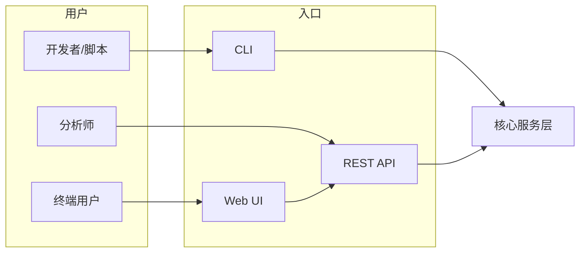

# 01 — 需求与目标

## 1. 项目定位

**Stock Analyzer** 是一个面向 A 股（可扩展港股/美股）的**数据采集 → 清洗存储 → 分析预测 → 可视化展示**一体化系统。核心约束来自 `.cursorrules`：

- 高并发爬取能力
- 请求**公平性**（多用户/多任务不饿死）
- **安全性**（密钥、限流、输入校验）
- **用户体验**（清晰 API/CLI、可观测、合理错误提示）

> **免责声明**：本项目仅供学习与研究，不构成任何投资建议。预测结果仅为统计模型输出，不保证收益。

## 2. 功能范围（MVP → 完整版）

### 2.1 数据爬取

| 能力 | MVP | 完整版 |
|------|-----|--------|
| 股票列表 / 基础信息 | ✓ | ✓ |
| 日 K / 分时行情 | 日 K | 分钟级 |
| 财务摘要（PE、营收等） | 可选 | ✓ |
| 增量更新、断点续爬 | ✓ | ✓ |
| 多数据源降级 | 单源 | 主备切换 |

### 2.2 数据分析

- 技术指标：MA、EMA、MACD、RSI、布林带
- 统计摘要：收益率、波动率、最大回撤、夏普比率（简化版）
- 板块/行业对比（完整版）

### 2.3 数据预测与走势

- **走势分析**：趋势识别（上升/下降/震荡）、支撑/压力位（枢轴点）
- **走势预测（两阶段，已确认）**：
  - **阶段 A**：可解释基线 — 移动平均外推、线性回归、Holt-Winters、ARIMA
  - **阶段 B**：重型深度学习 — LSTM、Transformer 等（可选依赖，见 [07-预测路线图.md](./07-预测路线图.md)）
- 统一输出：`forecast` 时间序列 + `confidence_interval`（可选）

### 2.4 数据可视化

- 静态图：K 线 + 均线 + 成交量（Matplotlib / Plotly）
- 交互图：Web 端 Plotly（完整版）
- 导出：PNG、HTML

## 3. 非功能需求

| 维度 | 目标 |
|------|------|
| 并发 | 单节点 ≥ 50 并发 HTTP（可配置），全局 QPS 受令牌桶限制 |
| 公平性 | 多任务队列 + 加权轮询，单 symbol 不独占带宽 |
| 安全 | 环境变量管理密钥；爬取遵守 robots/频率；API 鉴权（完整版） |
| 可测试 | TDD：单元测试覆盖率核心域 ≥ 80% |
| 可观测 | 结构化日志、爬取成功率、延迟分位数 |
| 可扩展 | 数据源、指标、预测器均插件化接口 |

## 4. 用户角色与使用场景

## 5. 成功标准（可验证）

1. 给定股票代码列表，能在配置时限内完成日 K 全量/增量入库。
2. 对任意已入库股票，可计算至少 5 种技术指标并返回 JSON。
3. 对任意已入库股票，可生成 30 日走势预测序列及可视化文件。
4. 在模拟 100 并发任务下，无任务饿死（最长等待 < 配置上限的 2 倍）。
5. `pytest` 全绿，CI 通过 lint + type check。
