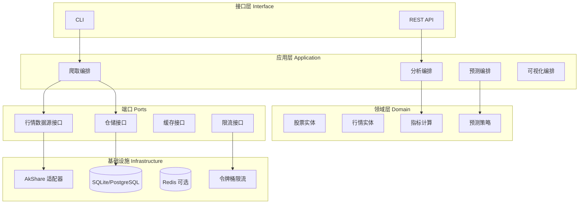
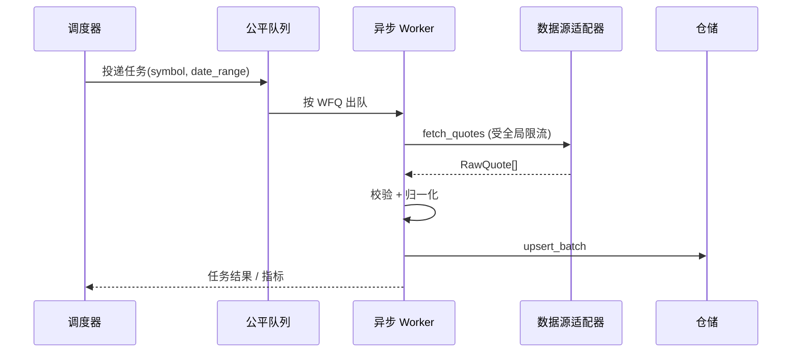

# 02 — 系统架构

## 1. 架构风格

采用 **六边形架构（端口与适配器）** + **分层职责**，便于 TDD 与替换数据源。



## 2. 核心数据流

### 2.1 爬取流水线



### 2.2 分析 / 预测流水线

1. 从仓储按 `symbol` + `date_range` 读取 `Quote` 序列
2. **分析**：纯函数计算指标 → `AnalysisResult`
3. **预测**：选择已注册 `ForecastStrategy` → `ForecastResult`
4. **可视化**：`ChartBuilder` 消费分析与预测结果 → 文件路径

## 3. 并发与公平性设计

### 3.1 并发模型

- **I/O 密集**：`asyncio` + `aiohttp`（或同步 `httpx` + 线程池，MVP 可二选一）
- **CPU 密集**（指标/预测）：`ProcessPoolExecutor` 或 `numpy` 向量化，避免阻塞事件循环

### 3.2 公平队列（WFQ 简化版）

每个 `tenant_id`（或 `job_id`）维护虚拟完成时间 `VFT`：

```
VFT_i += cost_i / weight_i
每次选取 VFT 最小的任务出队
```

- `weight` 默认相等；付费/高优先级租户可提高 weight
- 防止单一大范围批量任务占满 Worker

### 3.3 限流与安全

| 层级 | 机制 |
|------|------|
| 全局 | 令牌桶：max QPS、burst |
| 单域名 | 每 host 独立桶 |
| 单 IP 出口 | 连接池上限 |
| 重试 | 指数退避 + 最大次数；4xx 不重试（除 429） |
| 熔断 | 连续失败 N 次 → 打开熔断 → 半开探测 |

## 4. 模块边界

| 模块 | 输入 | 输出 | 禁止依赖 |
|------|------|------|----------|
| `domain` | 纯数据结构 / 算法 | 实体、值对象 | 不得依赖 infra、FastAPI |
| `application` | 用例 DTO | 用例结果 | 不得直接 HTTP |
| `infrastructure` | 端口接口实现 | 适配器 | 不得包含业务规则 |
| `interface` | HTTP/CLI 参数 | HTTP/CLI 响应 | 薄层，只做校验与映射 |

## 5. 部署视图（演进）

| 阶段 | 形态 |
|------|------|
| MVP | 单机：CLI + SQLite + 本地文件图 |
| V1 | Docker Compose：API + PostgreSQL + Redis |
| V2 | 可选 Celery/RQ 异步任务队列 |

## 6. 可观测性

- 日志：`structlog` JSON，字段含 `trace_id`, `symbol`, `latency_ms`, `status`
- 指标：爬取成功/失败计数、队列深度、限流等待时间
- 健康检查：`/health`（API 阶段）
