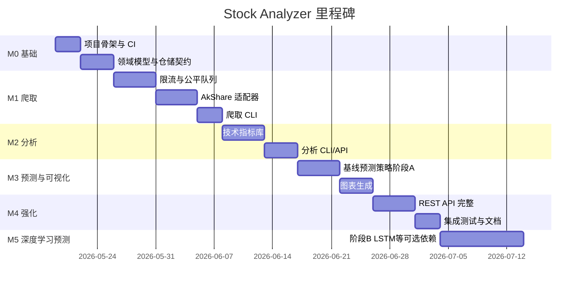

# 06 — 开发计划（TDD 迭代）

## 1. 里程碑



> 预测分阶段说明见 [07-预测路线图.md](./07-预测路线图.md)。

## 2. TDD 迭代顺序（红 → 绿 → 重构）

每个迭代：**先写失败测试 → 最小实现 → 重构**。

### 迭代 0：工程基础 ✅

| 测试 | 实现 | 验收 |
|------|------|------|
| `test_settings_loads_from_env` | `Settings` 类 | 已通过 |
| `test_package_importable` | `pyproject.toml` 布局 | 已通过 |

### 迭代 1：领域模型 ✅

| 测试 | 实现 | 验收 |
|------|------|------|
| `test_quote_validation_rejects_negative_price` | `Quote` 校验 | 已通过 |
| `test_stock_market_enum` | `Stock` 实体 | 已通过 |

### 迭代 2：指标计算（纯函数） ✅

| 测试 | 实现 | 验收 |
|------|------|------|
| `test_ma_calculates_correct_values` | `calc_ma` | 已通过 |
| `test_macd_matches_reference` | `calc_macd` | 已通过 |
| `test_rsi_bounded_0_100` | `calc_rsi` | 已通过 |

### 迭代 3：限流与公平队列 ✅

| 测试 | 实现 | 验收 |
|------|------|------|
| `test_token_bucket_blocks_when_empty` | `TokenBucket` | 已通过 |
| `test_fair_queue_no_starvation` | `FairQueue` | 100 任务模拟，已通过 |

### 迭代 4：仓储 ✅

| 测试 | 实现 | 验收 |
|------|------|------|
| `test_sqlite_upsert_idempotent` | `SqliteQuoteRepository` | 重复插入不重复行，已通过 |
| `test_get_quotes_date_range_inclusive` | - | 起止日含边界，已通过 |

### 迭代 5：爬取用例 ✅

| 测试 | 实现 | 验收 |
|------|------|------|
| `test_crawl_service_persists_quotes`（mock source） | `CrawlService` | 已通过 |
| `test_akshare_source_fetch_daily`（集成，标记 slow） | `AkShareSource` | 已通过（本地需网络） |

### 迭代 6：分析 / 预测（阶段 A）/ 可视化 ✅

| 测试 | 实现 | 验收 |
|------|------|------|
| `test_analysis_service_returns_indicators` | `AnalysisService` | 已通过 |
| `test_forecast_registry_lists_baseline_only` | `ForecastRegistry` | 已通过 |
| `test_ma_trend_forecast_horizon` | `MovingAverageForecast` | 已通过 |
| `test_linear_trend_forecast_horizon` | `LinearTrendForecast` | 已通过 |
| `test_chart_builder_writes_html` | `ChartBuilder` | 已通过 |

### 迭代 8：预测（阶段 B，深度学习，M5+） ✅

| 测试 | 实现 | 验收 |
|------|------|------|
| `test_lstm_forecast_requires_ml_extra` | 无 `ml` 依赖时导入提示清晰 | 已通过 |
| `test_lstm_forecast_horizon`（`@pytest.mark.ml`） | `LstmForecast` | 已通过（CI-ML workflow） |

### 迭代 7：接口层 ✅

| 测试 | 实现 | 验收 |
|------|------|------|
| `test_cli_crawl_invokes_service` | Typer CLI | 已通过 |
| `test_api_analysis_200` | FastAPI `TestClient` | 已通过 |
| `test_api_openapi_accessible` | OpenAPI | 已通过 |

## 3. 测试分层策略

```
tests/
├── unit/           # 领域、算法、限流 — 无网络
├── integration/    # SQLite、mock HTTP
└── e2e/            # 可选：真实 AkShare（@pytest.mark.slow）
```

- CI 默认：`pytest -m "not slow"`
- Nightly：全量含 slow

## 4. 第一期交付清单（MVP Definition of Done）

- [x] `stock-analyzer crawl` 可爬取并入库至少 2 只股票日 K
- [x] `stock-analyzer analyze` 输出 MA/MACD/RSI
- [x] `stock-analyzer predict` 输出 30 日预测
- [x] `stock-analyzer chart` 生成 HTML 图表
- [x] `document/` 设计文档齐全
- [x] README 含安装、配置、示例命令
- [x] 核心模块单元测试通过，`ruff` / `mypy` 无 error

## 5. 下一步行动

迭代 0–8 已完成。后续可选：

1. 扩展 API：`POST /api/v1/crawl`、`GET /api/v1/quotes/{symbol}`
2. 阶段 B 扩展：`transformer` 策略、预训练模型持久化
3. 初始化 Git 仓库并提交，避免源码丢失
