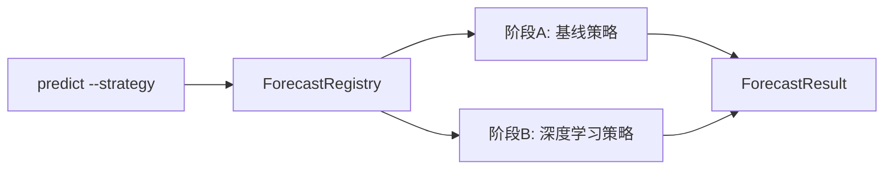

# 07 — 预测路线图（已确认）

## 原则

**先可解释基线，后重型深度学习。** 两阶段通过统一的 `ForecastStrategy` 端口接入，CLI/API 的 `--strategy` 参数不变。

## 阶段 A：可解释基线（M3，MVP 预测能力）

| 策略 ID | 模型 | 可解释性 | 依赖 |
|---------|------|----------|------|
| `ma_trend` | 均线趋势外推 | 高 | numpy |
| `linear_trend` | 收盘价线性回归 | 高 | numpy |
| `holt_winters` | 指数平滑 | 中 | statsmodels（可选） |
| `arima` | ARIMA | 中 | statsmodels（可选） |

**交付标准：**

- 每个策略有单元测试（固定 fixture 输入 → 预期输出形状与趋势标签）
- `ForecastResult` 含 `strategy`、`points[]`、`trend`（up/down/sideways）
- 可选 `lower` / `upper` 置信区间（基线可用残差标准差估计）

## 阶段 B：重型深度学习（M5+，独立可选依赖）

| 策略 ID | 模型 | 说明 |
|---------|------|------|
| `lstm` | LSTM | 需足够历史序列；GPU 可选 |
| `transformer` | 时序 Transformer | 实验性，成本高 |

**约束：**

- 依赖放入 `[project.optional-dependencies] ml = ["torch", ...]`，**不进入 MVP 默认安装**
- 训练/推理与基线策略隔离目录：`domain/forecast/deep/`
- 必须提供模型版本、训练数据截止日、评估指标（MAE/RMSE）元数据
- 文档与 CLI 明确标注：**黑盒模型，解释性低于基线**

## 架构：策略注册表

## TDD 顺序（预测模块）

1. `ForecastStrategy` 协议 + `ForecastResult` 模型
2. `ma_trend`、`linear_trend` 测试与实现（迭代 6）
3. `holt_winters`、`arima`（迭代 6 扩展）
4. `ForecastRegistry.register()` / `get(name)`
5. **阶段 B 开始后**再添加 `tests/unit/domain/forecast/deep/` 与 `ml` 可选依赖
